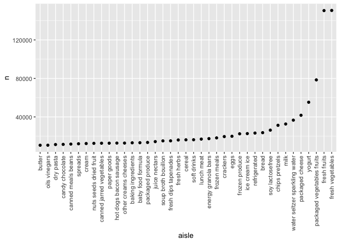

Homework 3
================
Leo Liu

``` r
library(p8105.datasets)
library(tidyverse)
```

    ## ── Attaching packages ─────────────────────────────────────────────────────────────────── tidyverse 1.3.0 ──

    ## ✓ ggplot2 3.3.2     ✓ purrr   0.3.4
    ## ✓ tibble  3.0.3     ✓ dplyr   1.0.2
    ## ✓ tidyr   1.1.2     ✓ stringr 1.4.0
    ## ✓ readr   1.3.1     ✓ forcats 0.5.0

    ## ── Conflicts ────────────────────────────────────────────────────────────────────── tidyverse_conflicts() ──
    ## x dplyr::filter() masks stats::filter()
    ## x dplyr::lag()    masks stats::lag()

``` r
library(ggplot2)
data("instacart")
```

Question 1.

This data set contains information of online grocery orders. It has
1384617 entries and 15 variables. The variables include product and
order identifiers, customer identifier, date and time the order was
placed, product name, the department the product belongs to, and aisle
where the product can be found, and if whether or not the product has
been reordered.

``` r
instacart %>% 
  count(aisle) %>% 
  arrange(desc(n))
```

    ## # A tibble: 134 x 2
    ##    aisle                              n
    ##    <chr>                          <int>
    ##  1 fresh vegetables              150609
    ##  2 fresh fruits                  150473
    ##  3 packaged vegetables fruits     78493
    ##  4 yogurt                         55240
    ##  5 packaged cheese                41699
    ##  6 water seltzer sparkling water  36617
    ##  7 milk                           32644
    ##  8 chips pretzels                 31269
    ##  9 soy lactosefree                26240
    ## 10 bread                          23635
    ## # … with 124 more rows

There are 134 aisles and the most orders come from fresh vegetables,
then fruits, and so on.

``` r
instacart %>% 
  count(aisle) %>% 
  filter(n > 10000) %>% 
  mutate(
    aisle = factor(aisle),
    aisle = fct_reorder(aisle, n)
  ) %>% 
  ggplot(aes(x = aisle, y = n)) +
  geom_point() +
  theme(axis.text.x = element_text(angle = 90, vjust = 0.5, hjust = 1))
```

<!-- -->

``` r
instacart %>% 
  filter(aisle %in% c("baking ingredients", "dog food care", "packaged vegetables fruits")) %>%
  group_by(aisle) %>% 
  count(product_name) %>% 
  mutate(rank = min_rank((desc(n)))) %>% 
  filter(rank < 4) %>% 
  arrange(aisle, rank) %>% 
  knitr::kable()
```

| aisle                      | product\_name                                 |    n | rank |
| :------------------------- | :-------------------------------------------- | ---: | ---: |
| baking ingredients         | Light Brown Sugar                             |  499 |    1 |
| baking ingredients         | Pure Baking Soda                              |  387 |    2 |
| baking ingredients         | Cane Sugar                                    |  336 |    3 |
| dog food care              | Snack Sticks Chicken & Rice Recipe Dog Treats |   30 |    1 |
| dog food care              | Organix Chicken & Brown Rice Recipe           |   28 |    2 |
| dog food care              | Small Dog Biscuits                            |   26 |    3 |
| packaged vegetables fruits | Organic Baby Spinach                          | 9784 |    1 |
| packaged vegetables fruits | Organic Raspberries                           | 5546 |    2 |
| packaged vegetables fruits | Organic Blueberries                           | 4966 |    3 |

Apples vs ice cream dow means day of week

``` r
instacart %>% 
  filter(product_name %in% c("Pink Lady Apples", "Coffee Ice Cream")) %>% 
  group_by(product_name, order_dow) %>% 
  summarize(mean_hour = mean(order_hour_of_day)) %>% 
  pivot_wider(
    names_from = order_dow,
    values_from = mean_hour
  )
```

    ## `summarise()` regrouping output by 'product_name' (override with `.groups` argument)

    ## # A tibble: 2 x 8
    ## # Groups:   product_name [2]
    ##   product_name       `0`   `1`   `2`   `3`   `4`   `5`   `6`
    ##   <chr>            <dbl> <dbl> <dbl> <dbl> <dbl> <dbl> <dbl>
    ## 1 Coffee Ice Cream  13.8  14.3  15.4  15.3  15.2  12.3  13.8
    ## 2 Pink Lady Apples  13.4  11.4  11.7  14.2  11.6  12.8  11.9

Question 2

``` r
accel_df = read_csv("./accel_data.csv") %>% 
  janitor::clean_names()
```

    ## Parsed with column specification:
    ## cols(
    ##   .default = col_double(),
    ##   day = col_character()
    ## )

    ## See spec(...) for full column specifications.

``` r
accel_df_long = accel_df %>% 
  pivot_longer(activity_1:activity_1440,
               names_to = "minute_of_the_day",
               values_to = "activity_counts") %>% 
  mutate(wkday_vs_wkend = ifelse(day %in% c("Saturday", "Sunday"), 
                                 "weekend", "weekday"),
         minute_of_the_day = as.numeric(substring(minute_of_the_day, 10)),
         week = as.character(week) %>% 
           forcats::fct_relevel(as.character(1:5)),
         day = forcats::fct_relevel(day,
                         c("Monday","Tuesday","Wednesday","Thursday","Friday","Saturday","Sunday"))
         ) %>% 
  group_by(week, day) %>%
  mutate(total_act_day = sum(activity_counts))
```

The dataset originally contains activity week, day, minute, and activity
counts. After tidying, the dataset includes the variable
‘minute\_of\_day’ which shows the minute when the activity is
performed. The variable ‘activity\_counts’ shows the amount of activity
performed. I have pivoted the data from wide to long, and added a
variable that indicates if whether or not the day of activity is a
weekday. The tidied data consists of 50400 entries and 7 variables.

``` r
accel_df_long %>% 
  group_by(week, day) %>% 
  summarise(total_act_day = sum(activity_counts)) %>%
  pivot_wider(names_from = day,
              values_from = total_act_day) %>% 
  knitr::kable()
```

    ## `summarise()` regrouping output by 'week' (override with `.groups` argument)

| week |    Monday |  Tuesday | Wednesday | Thursday |   Friday | Saturday | Sunday |
| :--- | --------: | -------: | --------: | -------: | -------: | -------: | -----: |
| 1    |  78828.07 | 307094.2 |    340115 | 355923.6 | 480542.6 |   376254 | 631105 |
| 2    | 295431.00 | 423245.0 |    440962 | 474048.0 | 568839.0 |   607175 | 422018 |
| 3    | 685910.00 | 381507.0 |    468869 | 371230.0 | 467420.0 |   382928 | 467052 |
| 4    | 409450.00 | 319568.0 |    434460 | 340291.0 | 154049.0 |     1440 | 260617 |
| 5    | 389080.00 | 367824.0 |    445366 | 549658.0 | 620860.0 |     1440 | 138421 |

There isn’t any apparent trend from the table. I was expecting more
activity counts during weekend, and less during weekdays. However, this
is only (partially) true for the second week. On the last two weeks,
least activity counts are recorded on Saturdays. It does not seem like a
person favors any day to do activities.

``` r
ggplot(accel_df_long, mapping = aes(x = minute_of_the_day, 
                                    y = activity_counts, 
                                    color = day)) +
  stat_smooth(geom = "line", se = FALSE) +
  scale_y_continuous(trans = "sqrt") +
  labs(
    title = "Total Activity Counts on Each Day (by minutes)",
    x = "Minutes",
    y = "Activity Counts"
  ) +
  viridis::scale_color_viridis(
    name = "Days",
    discrete = TRUE
  ) +
  theme_bw()
```

    ## `geom_smooth()` using method = 'gam' and formula 'y ~ s(x, bs = "cs")'

<!-- -->
From this plot, we are able to see that the most active times are during
500th to 1250th minute, which corresponds to roughly 8 am in the morning
to 9 pm in the evening. Activity counts vanish at midnight, when the
person goes to sleep. We can see that there are at least two peaks for
the trendlines everyday. On Sunday, the highest activity count is
recorded in the morning, at roughly 650 minutes into the day. More
activities seem to be done in the evening.

Question 3.

``` r
library(p8105.datasets)
data("ny_noaa")
```

Tidying: Precipitation prcp is given in tenths of mm, snowfall in mm,
snow depth in mm, tmax and tmin in tenths of degrees celsius. The most
common value for snowfall is 0 mm.

``` r
ny_noaa %>% 
  separate("date", c("Year", "Month", "Day"), sep = "-") %>%
  group_by(snow) %>% 
  count(snow) %>% 
  arrange(desc(n)) %>% 
  knitr::kable()
```

|  snow |       n |
| ----: | ------: |
|     0 | 2008508 |
|    NA |  381221 |
|    25 |   31022 |
|    13 |   23095 |
|    51 |   18274 |
|    76 |   10173 |
|     8 |    9962 |
|     5 |    9748 |
|    38 |    9197 |
|     3 |    8790 |
|   102 |    6552 |
|    10 |    5106 |
|    20 |    4797 |
|    64 |    4506 |
|   127 |    3901 |
|    15 |    3672 |
|    18 |    3226 |
|   152 |    3131 |
|    30 |    2814 |
|    89 |    2535 |
|    33 |    2380 |
|    46 |    2123 |
|    28 |    2118 |
|    23 |    1959 |
|   178 |    1650 |
|    36 |    1630 |
|   114 |    1578 |
|   203 |    1475 |
|    41 |    1467 |
|    43 |    1337 |
|    58 |    1198 |
|    56 |    1179 |
|    53 |    1155 |
|    71 |    1075 |
|   140 |     994 |
|    48 |     918 |
|    61 |     849 |
|    81 |     811 |
|    66 |     790 |
|   254 |     786 |
|   229 |     744 |
|    69 |     726 |
|    97 |     704 |
|    79 |     635 |
|   165 |     614 |
|    84 |     553 |
|   107 |     504 |
|    86 |     476 |
|    74 |     463 |
|   305 |     451 |
|    91 |     428 |
|   191 |     426 |
|   122 |     411 |
|    94 |     404 |
|   109 |     393 |
|   279 |     369 |
|   104 |     349 |
|   132 |     310 |
|   216 |     292 |
|    99 |     276 |
|   117 |     276 |
|   147 |     268 |
|   135 |     253 |
|   119 |     248 |
|   112 |     243 |
|   356 |     235 |
|   330 |     226 |
|   130 |     217 |
|   157 |     209 |
|   241 |     192 |
|   142 |     187 |
|   173 |     187 |
|   155 |     186 |
|   124 |     183 |
|   137 |     173 |
|   145 |     172 |
|   160 |     149 |
|   381 |     139 |
|   163 |     133 |
|   183 |     132 |
|   198 |     130 |
|   267 |     130 |
|   150 |     124 |
|   185 |     117 |
|   406 |     116 |
|   168 |     115 |
|   170 |     104 |
|   457 |     100 |
|   208 |      98 |
|   180 |      93 |
|   292 |      81 |
|   175 |      80 |
|   188 |      77 |
|   196 |      75 |
|   206 |      74 |
|   193 |      70 |
|   318 |      70 |
|   211 |      69 |
|   343 |      63 |
|   432 |      63 |
|   224 |      61 |
|   201 |      60 |
|   213 |      58 |
|   249 |      58 |
|   218 |      55 |
|   508 |      54 |
|   221 |      53 |
|   234 |      52 |
|   236 |      49 |
|   259 |      48 |
|   274 |      45 |
|   483 |      44 |
|   231 |      43 |
|   239 |      39 |
|   246 |      37 |
|   284 |      37 |
|   244 |      36 |
|   226 |      35 |
|   559 |      35 |
|   610 |      35 |
|   257 |      34 |
|   368 |      32 |
|   310 |      29 |
|   262 |      28 |
|   282 |      28 |
|   394 |      27 |
|   264 |      24 |
|   290 |      24 |
|   300 |      24 |
|   272 |      22 |
|   287 |      22 |
|   302 |      22 |
|   312 |      22 |
|   323 |      22 |
|   251 |      21 |
|   277 |      20 |
|   295 |      20 |
|   470 |      20 |
|   584 |      20 |
|   269 |      19 |
|   307 |      17 |
|   338 |      17 |
|   345 |      17 |
|   762 |      17 |
|   533 |      16 |
|   351 |      15 |
|   361 |      15 |
|   366 |      15 |
|   419 |      15 |
|   297 |      14 |
|   363 |      14 |
|   315 |      13 |
|   335 |      13 |
|   340 |      13 |
|   660 |      13 |
|   325 |      12 |
|   353 |      12 |
|   358 |      12 |
|   376 |      12 |
|   414 |      12 |
|   401 |      10 |
|   635 |      10 |
|   711 |      10 |
|   333 |       9 |
|   417 |       9 |
|   737 |       9 |
|   386 |       8 |
|   411 |       8 |
|   427 |       8 |
|   437 |       8 |
|   445 |       8 |
|   521 |       8 |
|   320 |       7 |
|   404 |       7 |
|   434 |       7 |
|   328 |       6 |
|   348 |       6 |
|   373 |       6 |
|   384 |       6 |
|   409 |       6 |
|   467 |       6 |
|   546 |       6 |
|   686 |       6 |
|   378 |       5 |
|   389 |       5 |
|   396 |       5 |
|   422 |       5 |
|   447 |       5 |
|   450 |       5 |
|   452 |       5 |
|   460 |       5 |
|   465 |       5 |
|   475 |       5 |
|   371 |       4 |
|   399 |       4 |
|   455 |       4 |
|   472 |       4 |
|   478 |       4 |
|   488 |       4 |
|   549 |       4 |
|   554 |       4 |
|   597 |       4 |
|   699 |       4 |
|   787 |       4 |
|   914 |       4 |
|   424 |       3 |
|   439 |       3 |
|   462 |       3 |
|   495 |       3 |
|   513 |       3 |
|   518 |       3 |
|   572 |       3 |
|   594 |       3 |
|   632 |       3 |
|   775 |       3 |
|   480 |       2 |
|   490 |       2 |
|   498 |       2 |
|   503 |       2 |
|   505 |       2 |
|   511 |       2 |
|   516 |       2 |
|   523 |       2 |
|   526 |       2 |
|   528 |       2 |
|   551 |       2 |
|   561 |       2 |
|   564 |       2 |
|   592 |       2 |
|   622 |       2 |
|   630 |       2 |
|   643 |       2 |
|   663 |       2 |
|   721 |       2 |
|   813 |       2 |
|   838 |       2 |
|   864 |       2 |
|  \-13 |       1 |
|   391 |       1 |
|   429 |       1 |
|   536 |       1 |
|   544 |       1 |
|   556 |       1 |
|   566 |       1 |
|   569 |       1 |
|   574 |       1 |
|   577 |       1 |
|   579 |       1 |
|   587 |       1 |
|   589 |       1 |
|   607 |       1 |
|   612 |       1 |
|   615 |       1 |
|   620 |       1 |
|   625 |       1 |
|   645 |       1 |
|   648 |       1 |
|   650 |       1 |
|   665 |       1 |
|   693 |       1 |
|   704 |       1 |
|   734 |       1 |
|   754 |       1 |
|   808 |       1 |
|   810 |       1 |
|   843 |       1 |
|   861 |       1 |
|   871 |       1 |
|   892 |       1 |
|   940 |       1 |
|   953 |       1 |
|   965 |       1 |
|   978 |       1 |
|  1041 |       1 |
|  1067 |       1 |
|  1105 |       1 |
|  1143 |       1 |
|  1207 |       1 |
|  6350 |       1 |
|  7122 |       1 |
|  7765 |       1 |
| 10160 |       1 |

``` r
ny_noaa = ny_noaa %>%
  separate("date", c("Year", "Month", "Day"), sep = "-") %>%
  mutate(across(Year:tmin, as.numeric),
         across(tmax:tmin, function(x) x/10)) %>% 
  mutate(snow = ifelse(snow < 0, 0, snow))

ny_noaa_0107 = ny_noaa %>% 
  filter(Month %in% c(1, 7)) %>% 
  group_by(id, Year,Month) %>%
  summarize(mean_t_max = mean(tmax, na.rm = TRUE))
```

    ## `summarise()` regrouping output by 'id', 'Year' (override with `.groups` argument)

``` r
ny_noaa_0107 %>%
  drop_na() %>% 
  ggplot(mapping = aes(x = Year, y = mean_t_max, color = id, group = id)) +
  geom_point() +
  geom_path() +
  scale_x_continuous(breaks = seq(1981, 2010, 2),
                     limits = c(1981, 2010))+
  labs(title = "Average Maximum Temperature (in deg Celsius) for Each Station on Jan and July across Years.",
       x = "Years",
       y = "Average Maximum Temperature") +
  theme(legend.position = "none") +
  facet_wrap(~ Month)
```

<!-- -->
From the graphs, we can see a lot of up and downs in the average maximum
temperature across the years. It is hard to conclude that the average
maximum temperature is rising or lowering. The coldest years are 1994
and 2004; in those two years, the average maximum temperatures for
January are around -12 degrees celsius. Some outliers include the
outlier in 1982, 2004 and 2005. For July, we see a notable outlier in
1988. The highest average temperature is less than 15 degrees celsius
for that particular outlier. Two other notable outliers are in the years
2004 and 2007. The years with the highest average max temperature are
1999 and 2010.

``` r
library(patchwork)
plot3 = ny_noaa %>%
  ggplot(mapping = aes(x = tmin, y = tmax, color = Year)) +
  geom_point() +
  labs(title = "Max vs Min Average Temperature",
       x = "Min average temperature in degrees celsius",
       y = "Max average temperature in degrees celsius") +
  theme_bw()

plot4 = ny_noaa %>% 
  filter(between(snow, 1,100)) %>% 
  group_by(Year) %>% 
  ggplot(mapping = aes(x = Year, y = snow, color = Year, group = Year)) +
   geom_boxplot() +
  labs(title = "Snow fall by Year",
       x = "Year",
       y = "Snowfall in mm") +
  theme_bw()

plot3 / plot4
```

    ## Warning: Removed 1136276 rows containing missing values (geom_point).

<!-- -->
