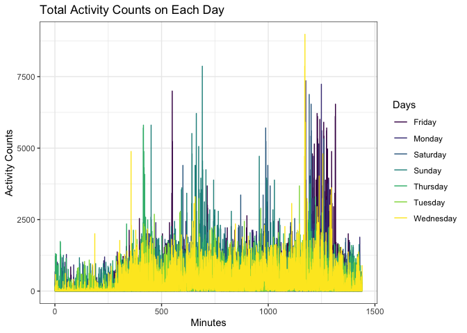
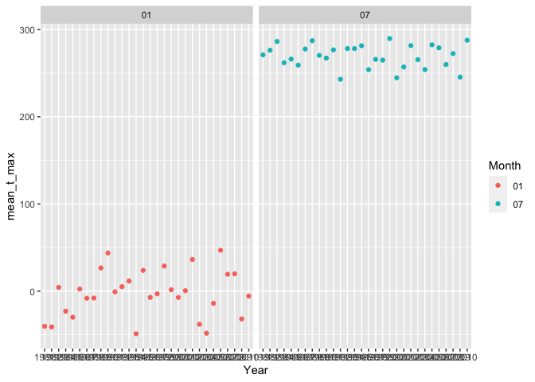
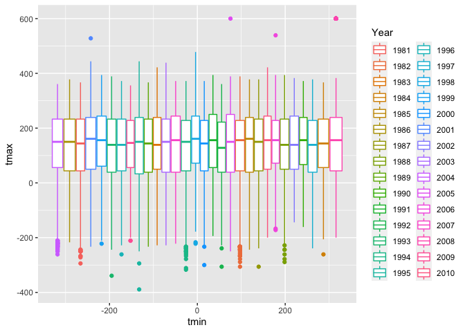
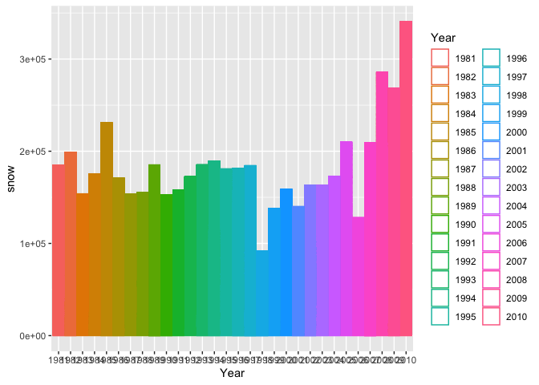

Homework 3
================
Leo Liu

``` r
library(p8105.datasets)
library(tidyverse)
```

    ## ── Attaching packages ─────────────────────────────────────────────────────────────────── tidyverse 1.3.0 ──

    ## ✓ ggplot2 3.3.2     ✓ purrr   0.3.4
    ## ✓ tibble  3.0.3     ✓ dplyr   1.0.2
    ## ✓ tidyr   1.1.2     ✓ stringr 1.4.0
    ## ✓ readr   1.3.1     ✓ forcats 0.5.0

    ## ── Conflicts ────────────────────────────────────────────────────────────────────── tidyverse_conflicts() ──
    ## x dplyr::filter() masks stats::filter()
    ## x dplyr::lag()    masks stats::lag()

``` r
library(ggplot2)
data("instacart")
```

Question 1.

This data set contains information of online grocery orders. It has
1384617 entries and 15 variables. The variables include product and
order identifiers, customer identifier, date and time the order was
placed, product name, the department the product belongs to, and aisle
where the product can be found, and if whether or not the product has
been reordered.

``` r
instacart %>% 
  count(aisle) %>% 
  arrange(desc(n))
```

    ## # A tibble: 134 x 2
    ##    aisle                              n
    ##    <chr>                          <int>
    ##  1 fresh vegetables              150609
    ##  2 fresh fruits                  150473
    ##  3 packaged vegetables fruits     78493
    ##  4 yogurt                         55240
    ##  5 packaged cheese                41699
    ##  6 water seltzer sparkling water  36617
    ##  7 milk                           32644
    ##  8 chips pretzels                 31269
    ##  9 soy lactosefree                26240
    ## 10 bread                          23635
    ## # … with 124 more rows

There are 134 aisles and the most orders come from fresh vegetables,
then fruits, and so on.

``` r
instacart %>% 
  count(aisle) %>% 
  filter(n > 10000) %>% 
  mutate(
    aisle = factor(aisle),
    aisle = fct_reorder(aisle, n)
  ) %>% 
  ggplot(aes(x = aisle, y = n)) +
  geom_point() +
  theme(axis.text.x = element_text(angle = 90, vjust = 0.5, hjust = 1))
```

<!-- -->

``` r
instacart %>% 
  filter(aisle %in% c("baking ingredients", "dog food care", "packaged vegetables fruits")) %>%
  group_by(aisle) %>% 
  count(product_name) %>% 
  mutate(rank = min_rank((desc(n)))) %>% 
  filter(rank < 4) %>% 
  arrange(aisle, rank) %>% 
  knitr::kable()
```

| aisle                      | product\_name                                 |    n | rank |
| :------------------------- | :-------------------------------------------- | ---: | ---: |
| baking ingredients         | Light Brown Sugar                             |  499 |    1 |
| baking ingredients         | Pure Baking Soda                              |  387 |    2 |
| baking ingredients         | Cane Sugar                                    |  336 |    3 |
| dog food care              | Snack Sticks Chicken & Rice Recipe Dog Treats |   30 |    1 |
| dog food care              | Organix Chicken & Brown Rice Recipe           |   28 |    2 |
| dog food care              | Small Dog Biscuits                            |   26 |    3 |
| packaged vegetables fruits | Organic Baby Spinach                          | 9784 |    1 |
| packaged vegetables fruits | Organic Raspberries                           | 5546 |    2 |
| packaged vegetables fruits | Organic Blueberries                           | 4966 |    3 |

Apples vs ice cream dow means day of week

``` r
instacart %>% 
  filter(product_name %in% c("Pink Lady Apples", "Coffee Ice Cream")) %>% 
  group_by(product_name, order_dow) %>% 
  summarize(mean_hour = mean(order_hour_of_day)) %>% 
  pivot_wider(
    names_from = order_dow,
    values_from = mean_hour
  )
```

    ## `summarise()` regrouping output by 'product_name' (override with `.groups` argument)

    ## # A tibble: 2 x 8
    ## # Groups:   product_name [2]
    ##   product_name       `0`   `1`   `2`   `3`   `4`   `5`   `6`
    ##   <chr>            <dbl> <dbl> <dbl> <dbl> <dbl> <dbl> <dbl>
    ## 1 Coffee Ice Cream  13.8  14.3  15.4  15.3  15.2  12.3  13.8
    ## 2 Pink Lady Apples  13.4  11.4  11.7  14.2  11.6  12.8  11.9

Question 2

``` r
accel_df = read_csv("./accel_data.csv") %>% 
  janitor::clean_names()
```

    ## Parsed with column specification:
    ## cols(
    ##   .default = col_double(),
    ##   day = col_character()
    ## )

    ## See spec(...) for full column specifications.

``` r
accel_df_long = accel_df %>% 
  pivot_longer(activity_1:activity_1440,
               names_to = "minute_of_the_day",
               values_to = "activity_counts") %>% 
  mutate(wkday_vs_wkend = ifelse(day %in% c("Saturday", "Sunday"), 
                                 "weekend", "weekday"),
         minute_of_the_day = as.numeric(substring(minute_of_the_day, 10))) %>% 
  group_by(day) %>% 
  mutate(total_act_day = sum(activity_counts))
  
  

daily_act_tbl = accel_df_long %>% 
  summarize(total_act_day = sum(activity_counts)) %>% 
  arrange(total_act_day)
```

    ## `summarise()` ungrouping output (override with `.groups` argument)

``` r
ggplot(accel_df_long, mapping = aes(x = minute_of_the_day, y = activity_counts, color = day)) + 
  geom_line() +
  labs(
    title = "Total Activity Counts on Each Day",
    x = "Minutes",
    y = "Activity Counts"
  ) +
  viridis::scale_color_viridis(
    name = "Days",
    discrete = TRUE
  ) +
  theme_bw()
```

<!-- -->

Question 3. facet\_wrap(\~ day)

``` r
library(p8105.datasets)
data("ny_noaa")
```

Tidying: Precipitation prcp is given in tenths of mm, snowfall in mm,
snow depth in mm, tmax and tmin in tenths of degrees celsius. The most
common value for snowfall is 0 mm.

``` r
ny_noaa %>% 
  separate("date", c("Year", "Month", "Day"), sep = "-") %>%
  group_by(snow) %>% 
  count(snow) %>% 
  arrange(desc(n))
```

    ## # A tibble: 282 x 2
    ## # Groups:   snow [282]
    ##     snow       n
    ##    <int>   <int>
    ##  1     0 2008508
    ##  2    NA  381221
    ##  3    25   31022
    ##  4    13   23095
    ##  5    51   18274
    ##  6    76   10173
    ##  7     8    9962
    ##  8     5    9748
    ##  9    38    9197
    ## 10     3    8790
    ## # … with 272 more rows

``` r
ny_noaa = ny_noaa %>%
  separate("date", c("Year", "Month", "Day"), sep = "-") %>%
  mutate(tmin = as.numeric(tmin),
         tmax = as.numeric(tmax))

ny_noaa_0107 = ny_noaa %>% 
  filter(Month %in% c("01", "07")) %>% 
  group_by(Year,Month) %>%
  summarize(mean_t_max = mean(tmax, na.rm = TRUE))
```

    ## `summarise()` regrouping output by 'Year' (override with `.groups` argument)

``` r
ny_noaa_0107 %>% 
  ggplot(mapping = aes(x = Year, y = mean_t_max, color = Month)) +
  geom_point() +
  facet_wrap(~ Month)
```

<!-- -->

``` r
ny_noaa %>% 
  ggplot(mapping = aes(x = tmin, y = tmax, color = Year)) +
  geom_boxplot()
```

    ## Warning: Removed 1134420 rows containing missing values (stat_boxplot).

    ## Warning: Removed 1856 rows containing non-finite values (stat_boxplot).

<!-- -->

``` r
ny_noaa %>% 
  filter(snow > 0, snow < 100) %>% 
  group_by(Year) %>% 
  ggplot(mapping = aes(x = Year, color = Year)) +
  geom_histogram(stat = 'identity', aes(y = snow), fill = "white")
```

    ## Warning: Ignoring unknown parameters: binwidth, bins, pad

<!-- -->
